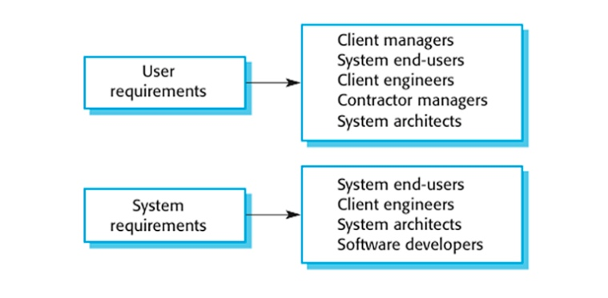
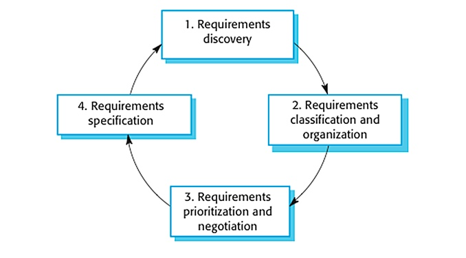

# TODO

> ## JULY
>
> - Footer
> - Responsive for smaller screens and Desktop
> - Buttons component
> - Variables
>
> *Everything* is going according to **plan**.

## Project Plan: ghp-app

**1** Introduction

- **1.1** Purpose of the requirements document

- Intergrate with service
- Provide a modern tech-savvy way to connect customers to a photography service intuitively.

\## End point where customers could create acccont providing the ability to

- [ ] Pay for services and packages
- [ ] Book a service
- [ ] Access resources

**1.2** Scope of Project

- Modules: Facilitate communication between customers and photographer
- Modules: Preformatted reply forms are used in every stage
- Modules: Configurable via the application’s service options.
- Modules: The system also contains a database containing a list of services, availability, packages, and locations



## User Requirements

- Epic 📌  

      As a <User X>, I want <Functionality Y> so that I <Achieve goal Z>

- As a user, I want to know the package total so I know how much it's going to cost me.
- As a user, I want to be able to book service so that I can reserve desired date.
- As a user, I want the ability to pay so that I can purchase selected package using the app.

## System Requirments

## Functional & Non-Functional Requirements

## Use Cases & Scenarios

[Scope-of-project](https://medium.com/@ayush_90732/how-to-define-the-project-scope-the-foolproof-way-782b239db2bc)

[User-Stories](https://medium.com/agileinsider/an-introduction-to-user-stories-for-product-managers-c4c4aef38950)



---
title: Project Structure Starter **6/22/22**

---

      ```
      .
      ├──public 
      ├── /src
      │   ├── /assets
      │   │  ├── /icons
      │   │  ├── /screenshot
      │   ├── /components
      │   │  ├── /Layout
      │   │  │     ├── About.js
      │   │  │     ├── Footer.js
      │   │  │     ├── Header.js
      │   │  ├── /Misc
      │   │  │     ├── AvailableServices.js
      │   │  │     ├── ServiceItem.js
      │   │  │     ├── Services.js
      │   │  ├── /Navigation
      │   │  │     ├── NavBar.js
      │   ├── images
      │   ├── styles
      │   │  ├── abstracts
      │   │  ├── base
      │   │  ├── layout
      │   │  ├── main.scss
      │   ├── App.js
      │   ├── index.js
      
      ```

[Medium](https://medium.com/@jilvanpinheiro/software-development-life-cycle-sdlc-phases-40d46afbe384)

[Software-Engineering](https://ifs.host.cs.st-andrews.ac.uk/Books/SE9/Web/index.html)
[SRS](https://medium.com/trailblazer-of-salesforce/software-requirements-specification-srs-document-fd9ab103b18#_Toc77487621)
[SRS-NIST](https://nvlpubs.nist.gov/nistpubs/ams/NIST.AMS.300-2.pdf)
[Write-a-good-SRS](https://www.geeksforgeeks.org/how-to-write-a-good-srs-for-your-project/?ref=lbp)
